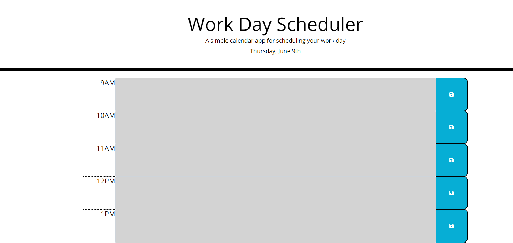

# work-day-planner

## Description

This project used jQuery to build a functioning app planner that shortens the number of tasks required to run the application.

Link to deplayed application: https://marquiswillis.github.io/code-quiz/

## Usage

- When the user clicks on the colored text field, the user can add their own events for the hours of the day. 
- When the user clicks on the save button, the user can save their own data to the text field and local storage.

